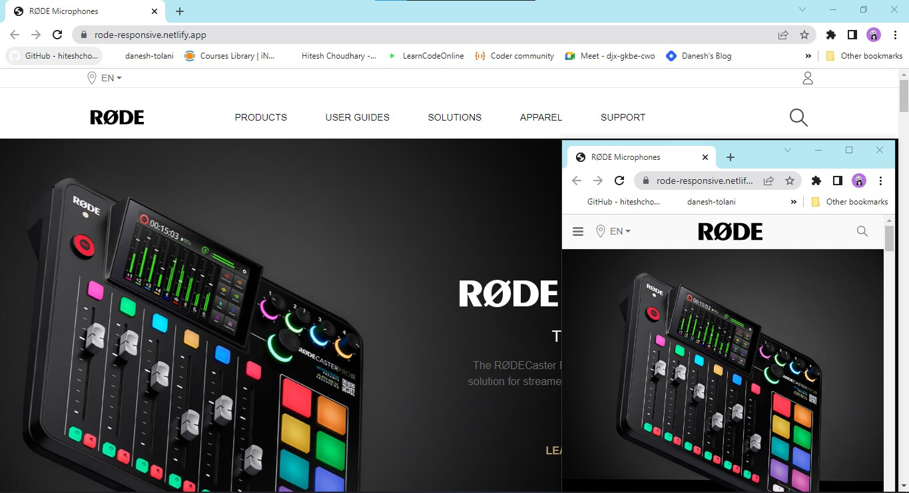

Hi, my name is **Danesh tolani**, and I have prepared Rode Microphones home page clone

Technologies Used:

This is a static webpage with some subtle transition effects like Button color changes when we hover on the button

- **Mobile Responsiveness**

This webpage is **Mobile Responsive** as well.

## Deployed Website

## My Blog on Hashnode:

---

---
